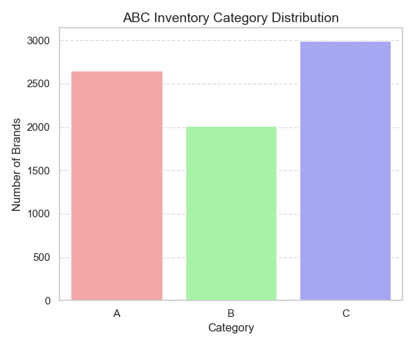
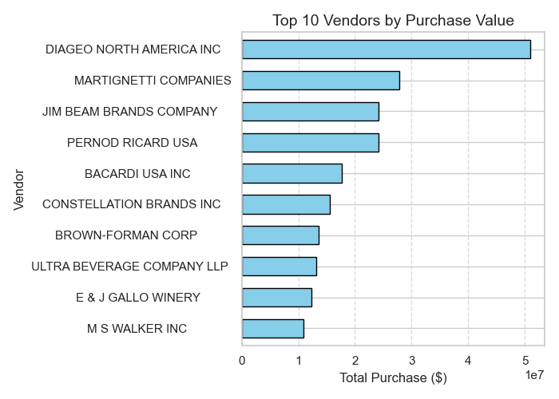
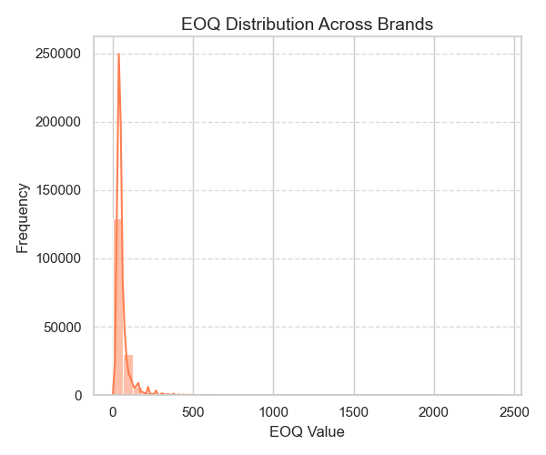
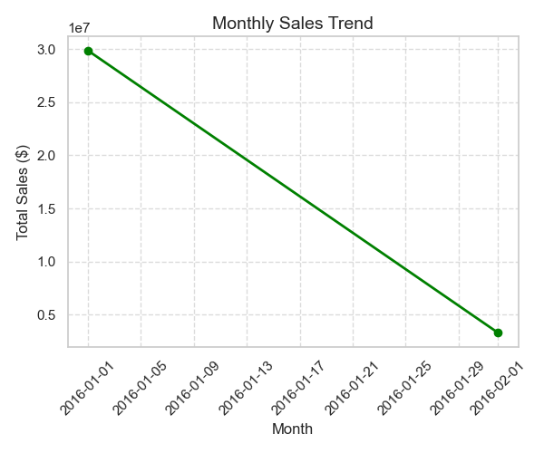
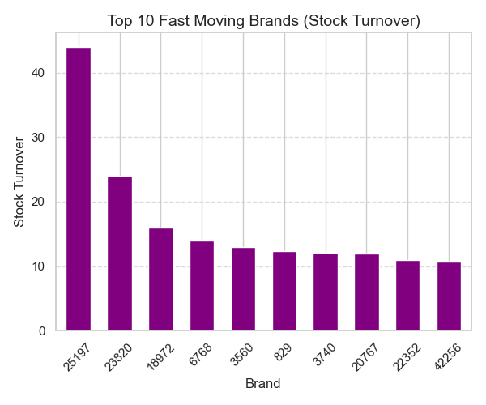
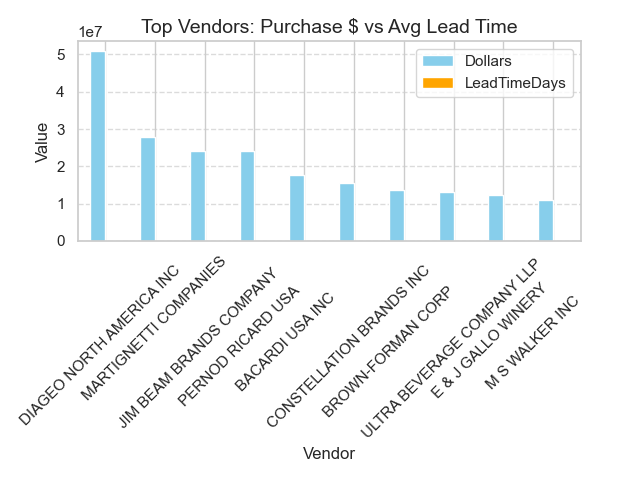

Slooze Inventory Analysis

This Python project performs comprehensive inventory analysis using CSV datasets for purchases, sales, and inventory. The analysis includes ABC classification, EOQ calculation, reorder points, stock turnover, vendor efficiency, and visualizations.

Files

CODE.py – Main Python script with all data processing, analysis, and visualization.

CSV datasets required:

InvoicePurchases12312016.csv

PurchasesFINAL12312016.csv

SalesFINAL12312016.csv

2017PurchasePricesDec.csv

BegInvFINAL12312016.csv

EndInvFINAL12312016.csv

Images:
Place your screenshot images in an images/ folder to reference visual outputs or for documentation purposes.

Requirements

Python 3.x

Python libraries:

pip install pandas numpy matplotlib seaborn

Using a Virtual Environment

It is recommended to use a virtual environment to manage dependencies.

Create a virtual environment:

python -m venv env

Activate the virtual environment:

Windows:

env\Scripts\activate

Mac/Linux:

source env/bin/activate

Install dependencies in the virtual environment:

pip install pandas numpy matplotlib seaborn

How to Run Locally

Download the project files and place all CSV files in the same directory as CODE.py.

Ensure the virtual environment is activated (optional but recommended).

Run the script:

python CODE.py

The script will:

Print ABC analysis, EOQ, reorder points, stock turnover, and vendor efficiency summaries to the console.

Generate visualizations for insights using Matplotlib & Seaborn.

Output

Console Outputs:

ABC category distribution

Sample EOQ values

Reorder points per brand

Top fast-moving brands

Vendor efficiency summary

Monthly sales trends

Visualizations:

ABC Inventory Category Distribution

Top Vendors by Purchase Value

EOQ Distribution

Monthly Sales Trend

Top Fast Moving Brands (Stock Turnover)

Vendor Efficiency (Purchase $ vs Lead Time)

Screenshots:

Save visual outputs or analysis screenshots in images/ folder.

Notes

Ensure that CSV files have correct column names and formats.

Date columns should be in a recognizable date format, numeric columns should be numeric.

Missing columns or files may cause errors.
